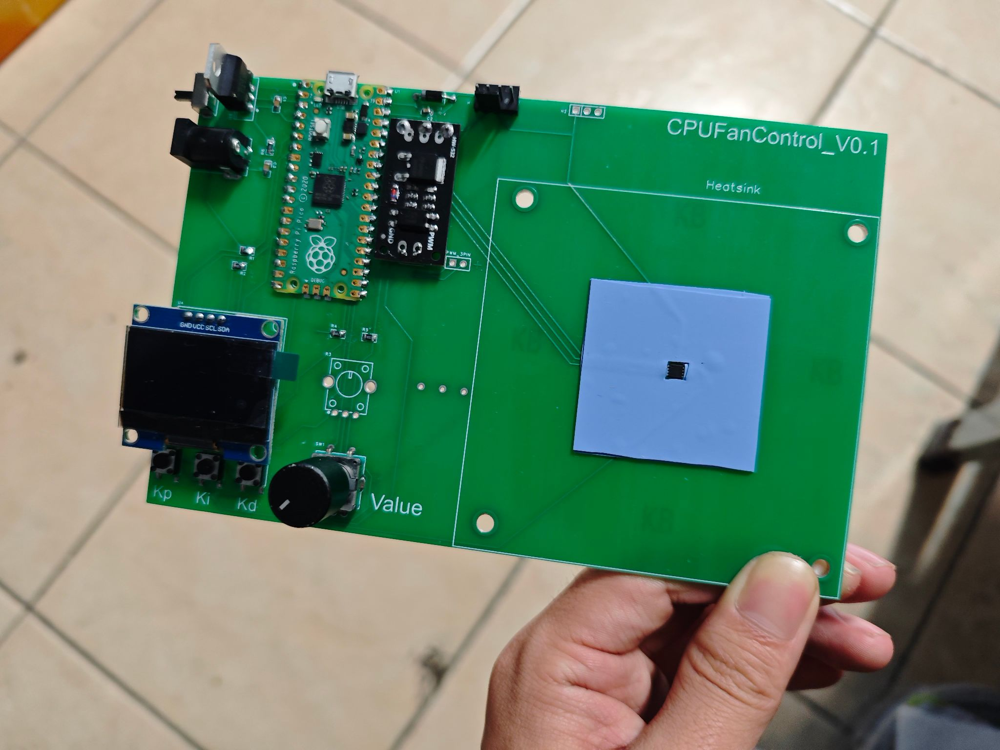
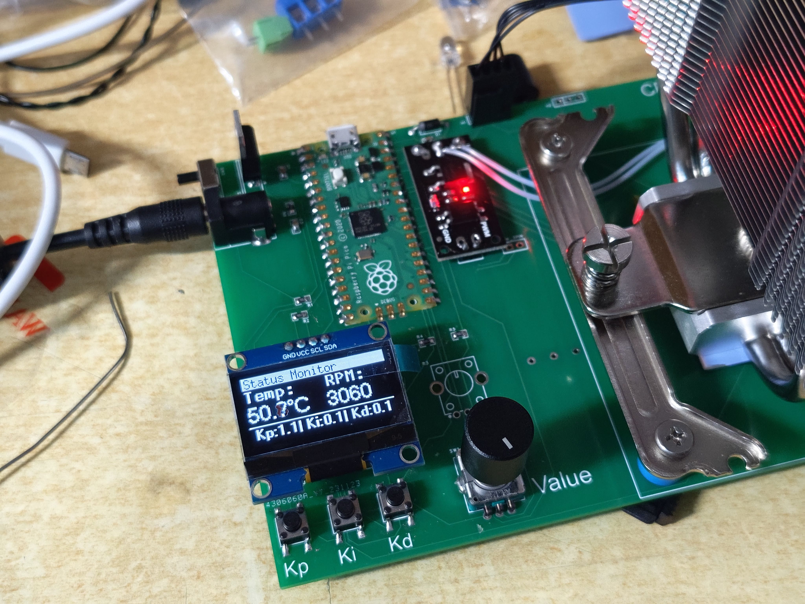

# CPUFanControl

# 控制工程综合设计-基于单片机的CPU风扇控制器

本仓库内包含了本课程设计用到的全部代码，采用Platform IO开发，基于Arduino框架。 
可在.pio/build/pico目录内找到编译完成的UF2文件。 
原理图及PCB图位于schematic/内。

## 操作指南：
菜单有三页，分别为状态检测、设置、曲线。状态检测可查看当前中心温度以及风扇转速，按下方的三个按钮再旋转编码器可以设置PID参数。按动编码器可以切换菜单页面。 
第二个页面可以通过旋转编码器设置目标温度，通过下方按钮可切换手动或自动模式、设置发热片工作模式（恒定功率或随机功率）。 
第三个页面可以查看过去96秒的温度状态，曲线图会自适应缩放。

## 其它参数
电源功率：96W 12V 6A 
发热片功率：45W  
供电方案：12V DC + 5V LDO 
单片机型号：RP2040 
屏幕分辨率：128x64  
散热器兼容性：Intel LGA 115x，4 Pin风扇

## 实物图片

### 这是未安装风扇的电路板，可以看到右侧被导热垫包围的温度传感器。 

### 运行时状态，屏幕显示的内容为菜单第一页